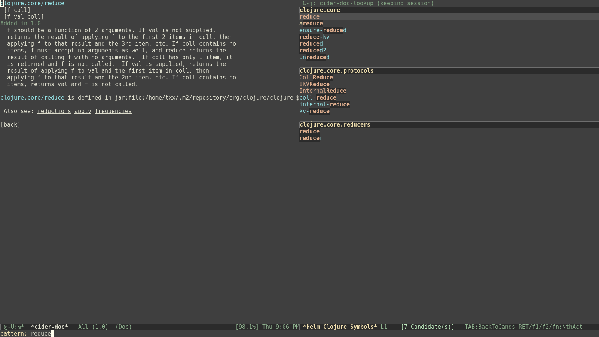
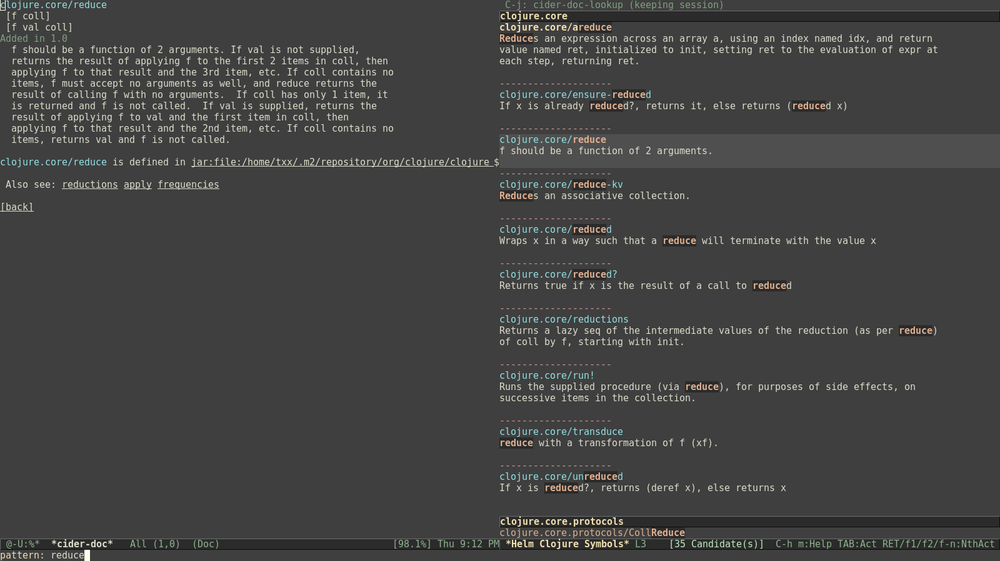
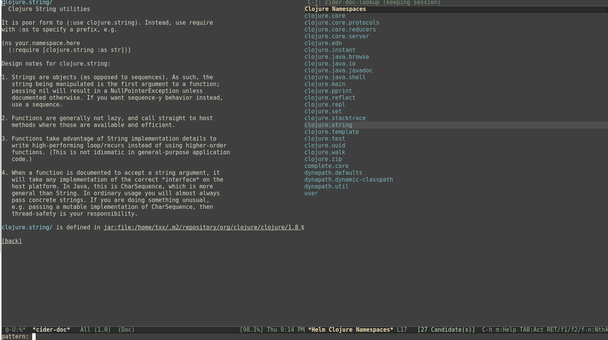
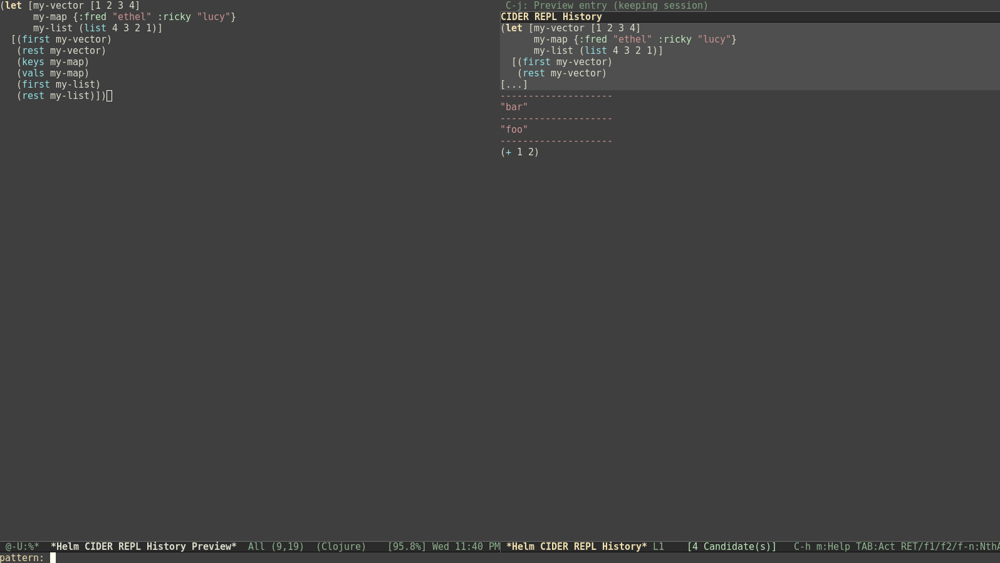

[](https://melpa.org/#/helm-cider)

# Helm Cider

[Helm](https://github.com/emacs-helm/helm) interface to [CIDER](https://github.com/clojure-emacs/cider).

## Installation

Install via [MELPA](https://melpa.org/#/).

For general information on installing Emacs packages, see the [Emacs Wiki](https://www.emacswiki.org/emacs/InstallingPackages).

## Setup

In your init file, add the following to activate `helm-cider-mode` and use Helm versions of CIDER commands:

```emacs-lisp
(helm-cider-mode 1)
```

Use `M-x helm-cider-mode` to turn the minor mode off, or call

```emacs-lisp
(helm-cider-mode -1)
```

## Features

The following assumes that `helm-cider-mode` is turned on, and that the reader is familiar with [Helm](https://github.com/emacs-helm/helm) functionality.

### Apropos

Calling `cider-apropos` or `cider-apropos-select` brings up a Helm buffer of all symbols across all namespaces (except those excluded using the `helm-cider-apropos-excluded-ns` customizable variable).

Each Helm source is a namespace. To select a namespace, use `C-c n` (the default value of `helm-cider-apropos-ns-key`) and select the desired namespace.



### Apropos documentation

Calling `cider-apropos-documentation` or `cider-apropos-documentation-select` brings up a Helm buffer of all symbols across all namespaces with documentation.

Select a namespace as with normal apropos.



### Namespaces

Calling `cider-browse-ns` or `cider-browse-ns-all` brings up a Helm buffer of namespaces.

Use `RET` to select a namespace and view symbols in that namespace *without* documentation. Use `S-RET` to select a namespace and view symbols in that namespace *with* documentation.



### REPL history

Calling `helm-cider-repl-history` (bound to `C-c C-l` by default) in a CIDER REPL brings up a Helm buffer of REPL entries.

Use `RET` to select an entry and insert it into the REPL.

Use `f2` to delete an entry from history. Multiple entries can be marked and deleted.



## See Also

- CIDER issue [#1541](https://github.com/clojure-emacs/cider/issues/1541), regarding [Ido](https://www.gnu.org/software/emacs/manual/html_mono/ido.html)/Helm support for `apropos`.
- CIDER issue [#1059](https://github.com/clojure-emacs/cider/issues/1059), regarding seeing more completion candidates and grouping them by namespace.
- [helm-clojure](https://github.com/prepor/helm-clojure), an earlier project with similar ideas.
